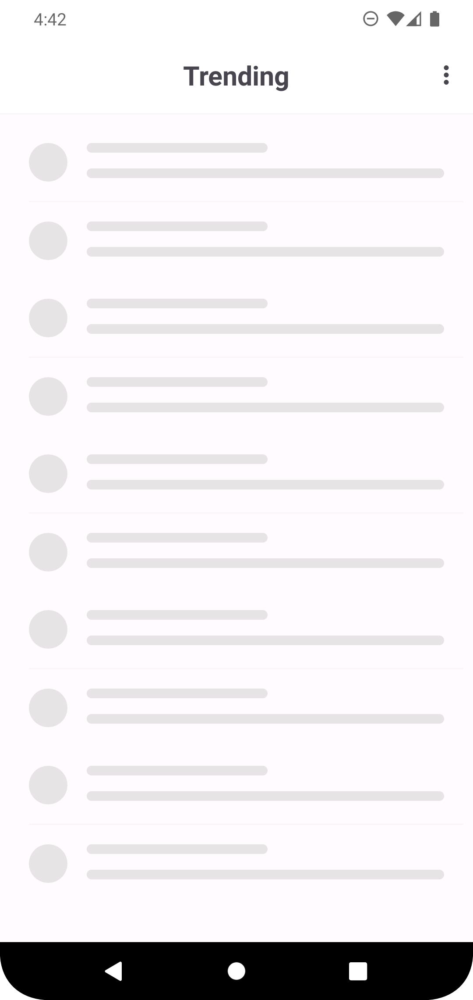
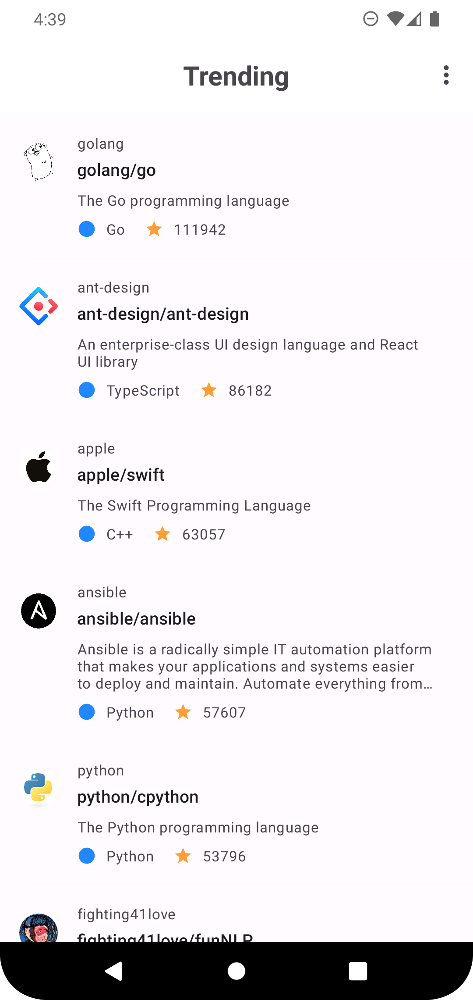
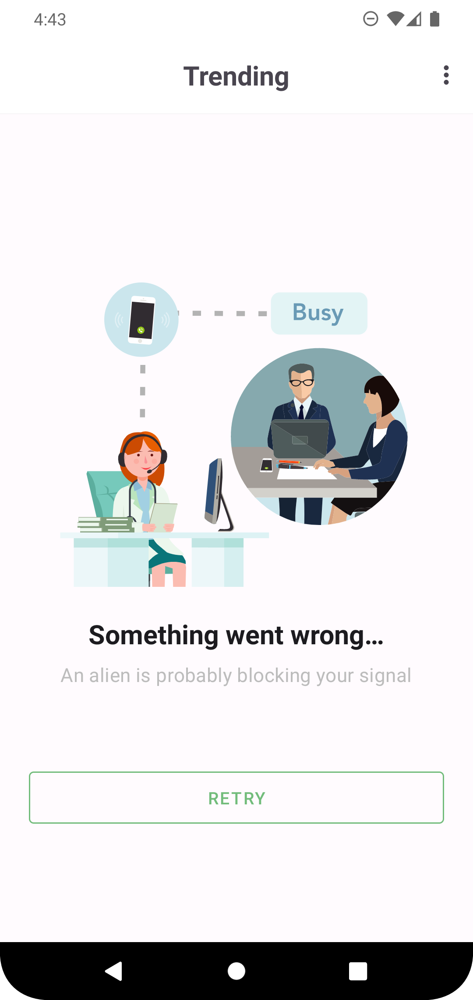
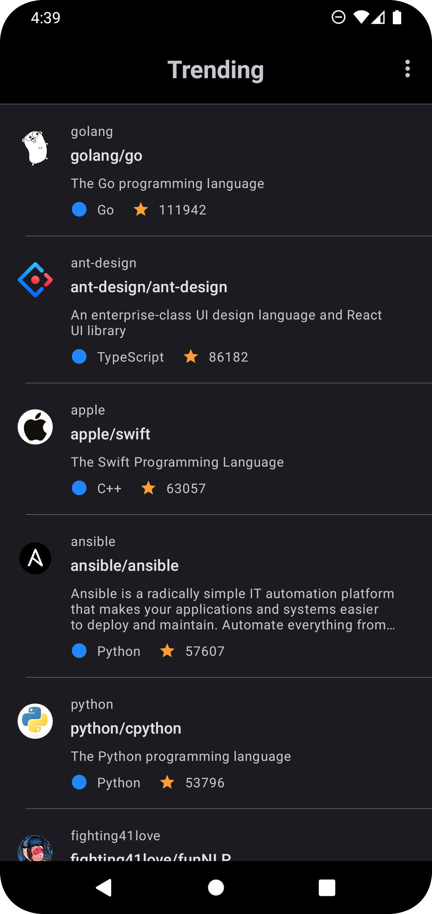

# TrendyRepo
Simple single screen app which shows the current trending Github repositories.

    
    
    
    

### <b> Tech Stack </b>
1. Clean Architecture
2. Local Unit Testing (JUnit, MockWebServer, Mockito, Google Truth)
3. Dagger-Hilt
4. Ktlint 
5. Detekt
6. Retrofit + Gson
7. Facebook Shimmer
8. Airbnb's Lottie
9. Picasso
10. Google Room's Database
11. edwnmrtnz libs
    * scopey - control the lifecycle of the presenter
    * local-testing - test utils and dependencies.

### <b> Structure </b>
The core module was divided into three package: <i>app, core, ui </i>.

- app - refers to classes specific to application like Application class, DI setup, Concrete Implementations and Initializers.
- core - refers to domain and data implementation. They can be thought of as component that can be extracted to its own module.
- ui - contains presentation layer classes.

Even though it was an MVP, a structure like this can scale well. For instance, <i> core </i> can live on its own module and have any app and feature module depend on it. In addition, a <i> presenter </i> module was extracted to avoid cluterring the ui package. 

### <b> Assumptions </b>
1. "Current" means today. So, app will cache the result of todays trending repositories and only fetch new records the next day. This is to balance between "stale data" vs "current" based on the requirements.
2. Even though the description says "Github", the core domain layer makes no assumption of whether trending repository is really from Github or not.
3. Even though its supposedly MVP, a scalable setup is done to accomodate if necessary. This includes ktlint, detekt, dependency injection framework, proper code structuring, and etc. Setup like these are cheap even in a short run especially when they are templated.
4. Overflow menu was used to support switching Dark/Light theme mode.
5. Some countries just have a bad internet connection. Small APK is very important for them to be able to download an app and use it. With these, ResourceShrinker and Code Obfuscator was enabled.
